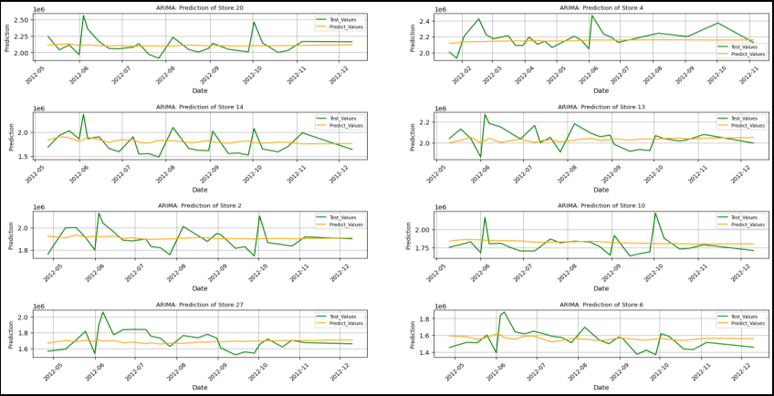
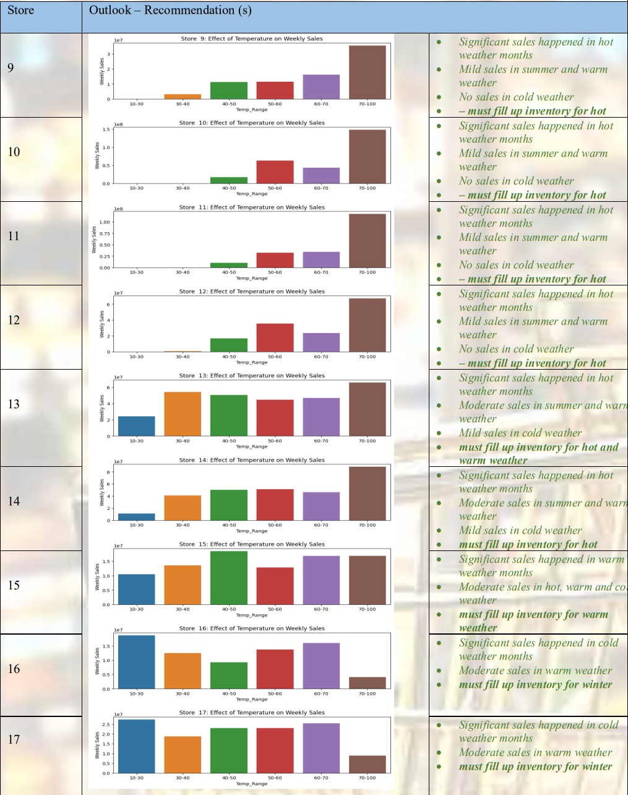

## Project Power BI Report Intro

https://github.com/DheerajLearner/Unguided-Project-Retail-Store-Analysis/assets/54669506/6b3d5a5e-c387-484a-bfc0-d9738bf2dc44

- For power BI snaps refer at last of readme file.

---

## Problem Statement
A retail company with multiple outlet stores is having bad revenue returns 
from the stores with most of them facing bankruptcy. This project 
undertakes to review the sales of records from the stores with a view to 
provide useful insights to the company and also to forecast sales outlook for
the next 12-weeks

---

## Project Objective
The Retail Company with multiple outlets across the country are facing 
issues with inventory management. The task is to come up with useful 
insights using the provided data and make prediction models to forecast the 
sales of next twelve weeks

---

## Data Description
The available dataset contains total entries of 6,435*8 having 6,435 rows 
and eight columns. Data Description, various insights from the data.
From the given dataset of the retail company, it is observed that the data 
consists of six thousand four hundred and thirty-five (6,435) records with 
seven features (recorded weekly) as follows:
1. Stores: There are 45 stores and each store has 143 entries of:
2. Date of record (weekly),
3. Total sales record for the week,
4. Holiday flag for the week (1 or 0),
5. Temperature: average temperature recorded during the week
6. Fuel Price: average fuel price for the week,
7. CPI: average Consumer Price Index for the week
8. Unemployment: rate of the unemployment for the week of record

---
## Data Pre-processing Steps and Inspiration
The pre-processing of the data included the following steps:
1. Step 1: Load Data
2. Step 2: Perform ***Exploratory Data Analysis***
    - Confirm number of records in the data and how they are distributed
    - Check data types
    - Check for missing data, invalid entries, duplicates
    - Examine the correlation of the independent features with the target (Weekly_Sales) variables.
    - Check for outliers that are known to distort predictions and forecasts.
3. Step 3: See relations between independent and dependent variables and make inferences.
4. Step 4: Model Predictions, two approaches:
    - Linear Regression Models.
    - Time Series Model (ARIMA, SARIMAX).
5. Step 5: Forecast
6. Step 6: Compare result from different models

   

---

## Techniques and Data Visualization

**Model Approach**:
1. *Regression Models*:
    - Gradient Boosting, Linear Regression and Random forest 
models were also used for the prediction. The best of the three 
predictions will then be compared to the predictions by 
ARIMA or SARIMAX model predictions.
2. *Time Series Model, ARIMA*
    - Using the best ARIMA order, make predictions for the 
selected stores.
    - Forecast using SARIMAX
    - Detrend the dataset if necessary,
    - Using SARIMAX estimate 12 weeks forecast

**Correlation Design**

- It was observed from the EDA that the effects of the independent 
variables (Unemployment, Temperature, Holiday_Flag, and CPI) on the 
target variable, weekly sales differ greatly by the store. For example, as 
shown above the effects of unemployment vary by the stores whereas it 
appears to have positive effects on some and negative effects on others. 
The same is also true for Temperature, CPI, and Holiday Flag to some 
extent.
- Premised on the findings, the decision was taken to handle the model, 
predictions by the stores as a single prediction for all the stores may not be 
reasonable given the peculiar conditions prevalent in each region of the 
stores.
- For simplicity and ease of presentation, I have also decide to limit my 
predictions for top eight stores with highest weekly revenue, however the 
model provided cane be used for predictions for other stores or all stores.

---

## Inferences from the Project
### Model Results:
1. ***ARIMA Model*** :
   ### code
        detrend_forecast = pd.DataFrame(columns = ['Store','Forecasted_Date','Forecasted_Weekly_Sales','Arima_Predict','Arima_Date','Test_value',
                                       'Test_Date','Full_Arima_Predict','Full_Arima_Predict_dates','Actual_Date','Actual_value','Order (p,d,r)'])
        for i in store_list:
          fore_store = get_store_df(df_rem, i)
          fore_store = fore_store[['Weekly_Sales']]
          fore_store.index.sort_values()

          moving_average = fore_store['Weekly_Sales'].rolling(window = 52, min_periods=1, center=True).mean()
          rolling_mean_detrended = fore_store['Weekly_Sales'] - moving_average

          rolling_mean_detrended_not_null = rolling_mean_detrended.dropna()
          train_index = len(rolling_mean_detrended_not_null)//5
          train = rolling_mean_detrended_not_null.iloc[:-train_index]
          test = rolling_mean_detrended_not_null.iloc[-train_index:]

          model = auto_arima(rolling_mean_detrended.dropna(), trace=False, error_action='ignore', suppress_warnings=True)
          p,d,r = model.order
          if p == 0 & r == 0:
            p,q,r = order_forecast(rolling_mean_detrended.dropna())

          # model train predict
          arima_model = ARIMA(train, order = (p,d,r))
          arima_fit = arima_model.fit()
          preds = arima_fit.predict(start = len(train), end = len(rolling_mean_detrended)-1)
          arima_pred = preds.values + moving_average.loc[test.index]

          #full model fit
          full_arima_model = ARIMA(rolling_mean_detrended.dropna(), order = (p,d,r))
          full_arima_fit_model = full_arima_model.fit()

          # Full Predicted
          full_arima_preds = full_arima_fit_model.predict(start = 0, end = len(rolling_mean_detrended)-1)
          reconstructed_sales = full_arima_preds + moving_average.loc[rolling_mean_detrended.index]

          # forecast
          arima_forecast = full_arima_fit_model.get_forecast(steps = 12)
          final_forecast = arima_forecast.predicted_mean + moving_average[-1]
          final_forecast_dates = pd.date_range(start = fore_store.index[-1], periods = 13, freq = 'W' )[1:]

        detrend_forecast = detrend_forecast.append({'Store':i, 'Forecasted_Date':final_forecast_dates, 'Forecasted_Weekly_Sales':
                                                    final_forecast.values,'Arima_Predict':arima_pred,'Arima_Date':test.index,'Test_value':fore_store.iloc[-train_index:]['Weekly_Sales'].values,
                                              'Test_Date':fore_store.iloc[-train_index:]['Weekly_Sales'].index, 
                                              'Full_Arima_Predict':reconstructed_sales,'Full_Arima_Predict_dates':reconstructed_sales.index,'Actual_value': fore_store['Weekly_Sales'].values, 'Actual_Date': 
                                               fore_store.index,'Order (p,d,r)': (p,d,r) }, ignore_index = True)

   - **Predictions**: Predictions were performed for eight stores (stores: 20, 4, 14, 13, 2, 
10, 27 and 6) in order of decreasing weekly sales revenue. The 
predictions results are summarized in the Table and graphs below:

   - **Forecast**: The initial results of the forecast shown above are not very good 
showing evidence of noise which maybe as a result of trends, and the 
observed outliers in the dataset which are distorting the forecasts. As 
a result, the dataset was detrended and the forecast repeated.

- The forecast after detrending sales shows the anticipated variabilities. 
However the overall projected sales outlook for the next 12 weeks is 
down for all the stores studied.

2. ***Regression Models***:
- The predictions of the three models Gradient Boosting, Linear 
Regression and Random Forest are shown below:
### *Code*
    info_df = pd.DataFrame(columns=['Store', 'model','train_Actual','train_Predict', 'test_Actual',             
                                    'test_Predict','total_Actual','total_Predict','train_date','test_date','forecast_y_Date','forecast_y_test','forecast_test_data', 'total_date', 'no_of_estimators', 
                                    'max_features','max_depth'] )
    store_list = [20,4,14,13,2,10,27,6]
    for i in store_list:
      fin_store = get_store_df(df_rem, i)
      fin_store.drop('Fuel_Price', axis = 1, inplace = True)
      array = fin_store.values
      X = array[:,2:6]
      y = array[:,1:2]
      z = fin_store.index
      # Split Data Into Train and Test
      X_train, X_test, y_train, y_test, z_train_date, z_test_date = train_test_split(X, y, z, train_size=0.75, random_state=42 )
      # Forecast y-Test data
      test_index = len(fin_store)//5
      forecast_X_test = X[-test_index:]
      forecast_y_test = y[-test_index:]
      forecsat_y_date = z[-test_index:]
      # Hyper paramenters to be used for algorithm Tuning
      n_estimators = np.array([50,100,150,200,250])
      max_features = np.array([1,2,3,4,5])
      max_depth= [3, 4, 5, 6, 7]

      # Searching best hyperparamenters for Rnadom Forest
      param_grid = dict(n_estimators=n_estimators,max_features=max_features, max_depth = max_depth)
      model = RandomForestRegressor()
      kfold = KFold(n_splits=10, random_state=42, shuffle = True)
      grid = GridSearchCV(estimator=model, param_grid=param_grid, scoring='neg_mean_squared_error', cv=kfold)
      grid_result = grid.fit(X_train, y_train)
      # Perdicting value by randomfroest model by using best parameters
      rf_model = RandomForestRegressor(n_estimators=grid_result.best_params_['n_estimators'], max_features=grid_result.best_params_['max_features'])
      rf_model.fit(X_train, y_train)
      rf_pred_test = rf_model.predict(X_test)
      rf_pred_train = rf_model.predict(X_train)
      rf_forecast_test = rf_model.predict(forecast_X_test)
      # appending values got from the process
      info_df = info_df.append({'Store':i, 'model': 'RF','train_Actual':y_train,'train_Predict':rf_pred_train,
                            'test_Actual':y_test, 'test_Predict':rf_pred_test,'forecast_y_test':forecast_y_test,'forecast_test_data':rf_forecast_test,'forecast_y_Date':forecsat_y_date, 'train_date':z_train_date,                             'test_date':z_test_date ,
                            'no_of_estimators':grid_result.best_params_['n_estimators'], 'max_features':grid_result.best_params_['max_features'],
                            'max_depth':grid_result.best_params_['max_depth']}, ignore_index=True)

      # Using linear Regression model for prediction
      li_model = LinearRegression()
      li_model.fit(X_train, y_train)
      li_pred_test = li_model.predict(X_test)
      li_pred_train = li_model.predict(X_train)
      li_forecast_test = li_model.predict(forecast_X_test)
      # appending values got from the process
      info_df = info_df.append({'Store':i, 'model': 'LR','train_Actual':y_train,'train_Predict':li_pred_train,
                            'test_Actual':y_test, 'test_Predict':li_pred_test,'forecast_y_test':forecast_y_test,'forecast_test_data':li_forecast_test,'forecast_y_Date':forecsat_y_date,'train_date':z_train_date,                               'test_date':z_test_date ,'no_of_estimators':None, 'max_features':None,'max_depth':None}, ignore_index=True)

      # searching best parameters for gradient boosting model
      param_grid1 = dict(n_estimators=n_estimators, max_depth = max_depth)
      model1 = GradientBoostingRegressor()
      grid1 = GridSearchCV(estimator=model1, param_grid=param_grid1, scoring='neg_mean_squared_error', cv=kfold)
      grid_result1 = grid1.fit(X_train, y_train)
      # Predictiong values by gradient boosting model using best hyper parameters
      gb_model = GradientBoostingRegressor(n_estimators = grid_result1.best_params_['n_estimators'],max_depth = grid_result1.best_params_['max_depth'])
      gb_model.fit(X_train, y_train)
      gb_pred_test = gb_model.predict(X_test)
      gb_pred_train = gb_model.predict(X_train)
      gb_forecast_test = gb_model.predict(forecast_X_test)
      # appending values got from the process
      info_df = info_df.append({'Store':i, 'model': 'GB', 'train_Actual':y_train,'train_Predict':gb_pred_train,
                            'test_Actual':y_test, 'test_Predict':gb_pred_test,'forecast_y_test':forecast_y_test,'forecast_test_data':gb_forecast_test,'forecast_y_Date':forecsat_y_date,'train_date':z_train_date,                              'test_date':z_test_date ,'no_of_estimators':grid_result1.best_params_['n_estimators'], 'max_features':None, 'max_depth':grid_result1.best_params_['max_depth']}, ignore_index=True)

    for i in info_df.index.tolist():
      info_df.at[i, 'total_Actual'] = np.array(info_df['train_Actual'][i].tolist()+info_df['test_Actual'][i].tolist())
      info_df.at[i, 'total_Predict'] = np.array(info_df['train_Predict'][i].tolist()+info_df['test_Predict'][i].tolist())
      info_df.at[i, 'total_date'] = np.array(info_df['train_date'][i].tolist()+ info_df['test_date'][i].tolist())

### Model Evaluation:
1. ***ARIMA/SARIMAX Models***:
- The model predictions for the selected stores were okay. The 
forecast after detrending was also okay showing variabilities of the 
weekly sales in line with sales history as shown below:

2. ***Regression Models***:
- The regression model results is summarize
below:

- As seen, the mean percentage error is between 3.6% to 9.1% for all 
the models which is within acceptable range. As seen in the prediction 
report table, the results from the three models are very comparable.

- The summary of the evaluation report (r2, ad_r2, 
root_mean_squared_error and mean_absolute_percentage_error) is 
presented in the table below. It’s noted below:-

- Mean_squared_error, r2, which is a measure of the goodness of fit of 
the model to the data is negative for all the models. However, the 
mean absolute percentage error (for both test and train) which is a 
measure of the accuracy of the model is very good for all the models.

3. ***Comparing Models***:

***Temperature Effects on weekly sales***: Evaluation of how changes in 
temperature effects the weekly sales revenue is presented below:

---

## Future Possibilities
Future of Machine learning is revolutionary and exciting. At present it is 
used in healthcare with personalized treatments, empower autonomous 
systems for safer transportation and industry, and drive ethical AI 
innovations ensuring fairness and transparency in decision-making across 
sectors.
By helping enterprises to better understand both customer’s and business 
functioning behaviour, Machine learning enables companies to offer 
better/targeted customer service leading to more loyal customers and 
ultimately improved sales revenue.
All over the world, almost all big corporate organizations (Facebook, Apple, 
Amazon and Google) and many more companies employ machine learning 
in their daily operations.

---

## Conclusion
The project undertook a study of a retail company with 45 outlets stores. 
Some of the key findings from the survey include the following:
1. Sales projection of next 12 weeks for the most of the stores is 
down.
2. Mild no of stores have no sales in some period of year mostly in 
cold season.
3. To improve sales revenue, the following steps are recommended:
    - Concerted efforts by the company to find out though local 
market surveys and past sales records what products are in 
high demand by the local population at any given period of 
the year and make effort to replenish those stocks.
    - Create increased local awareness of the products on offer at 
each store through commercial outreach: social media, 
television commercials and trade shows to name a few, could 
help improve sales.
    - Have detailed records of inventory of the items on offer at 
each store indicating amount and dates if sold as it is needed 
for effective inventory tracking which could help in 
maintaining stores offer.
    - Explore other service options that have worked well for 
similar companies, such as same day or next day delivery or 
services provided for the product provided.
It may result to wounding some stores as sales revenue does not 
improve.

---

## References

1. **Time Series Analysis and Its Applications by Robert H. Shumway and 
David S. Stoffer**: This textbook covers various aspects of time series 
analysis, including stationarity, decomposition, and forecasting 
techniques.
2. **Forecasting: Principles and Practice by Rob J Hyndman and George 
Athanasopoulos**: This online textbook provides a comprehensive 
overview of forecasting methods, including ARIMA, SARIMA, and 
SARIMAX models, along with practical examples.
3. **Python for Data Analysis by Wes McKinney**: This book covers data 
analysis techniques using Python, including time series analysis with 
pandas, statsmodels, and other libraries.
4. **Statsmodels Documentation**: The official documentation for 
statsmodels library offers detailed information on time series analysis 
and forecasting methods available in Python
5. **Blogs and Articles**:
Data science blogs like Towards Data Science, Analytics Vidhya, and 
Medium often publish articles on time series analysis and forecasting.

---

## Power BI Snaps

---

---

---

---

link: https://app.powerbi.com/links/0spP5Sqsah?ctid=6b51660e-85ef-45af-8d1d-d1b469791224&pbi_source=linkShare&bookmarkGuid=420f4d88-e5ea-446a-babd-c8286d97f777

